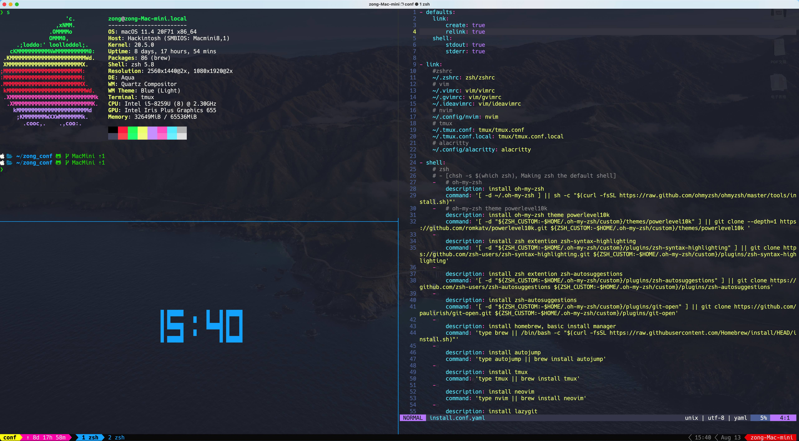

# ZZZZone conf



## Instalación

**Si ya tienes una configuración propia, recuerda hacer una copia de seguridad antes de ejecutar los comandos.**

1. Instalación con un solo comando  
   > Gestionado con [dotbot](https://github.com/anishathalye/dotbot).

   ```bash  
   git clone https://github.com/ZZZZone/zong_conf.git && cd zong_conf
   sh ./install
   ```

2. Instalación manual

Consulta los [comandos para la instalación manual](./install.md)

## Configuraciones y programas incluidos

- zsh
  - oh-my-zsh
    - theme: powerlevel10k
  - zsh-syntax-highlighting
  - zsh-autosuggestions
  - git-open
  - autojump
- tmux
  - Oh my tmux (gpakosz/.tmux)
- vim
  - nvim
  - macvim
  - ideavim
- ranger
- lazygit
- alacritty
