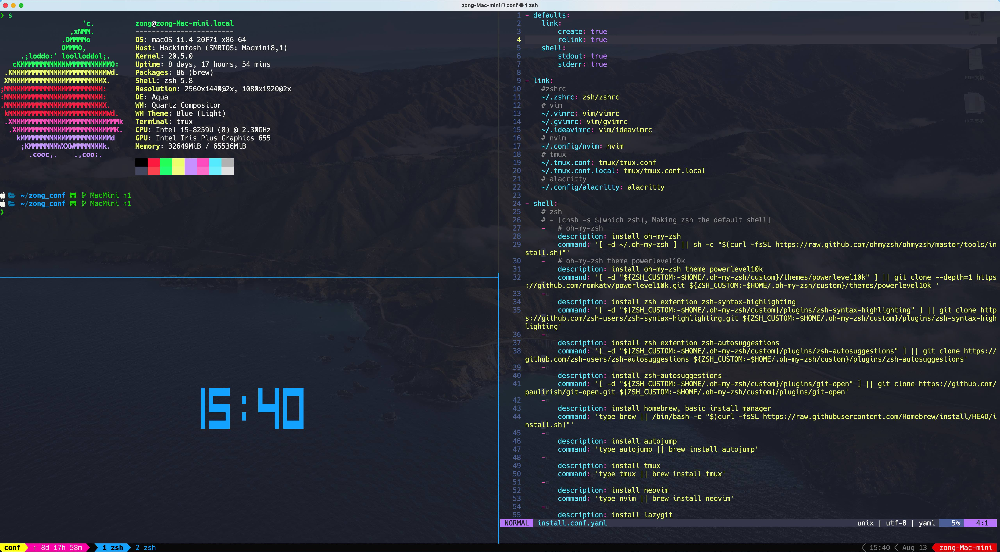

# ZZZZone conf



包含的配置以及程序:  

- zsh
  - oh-my-zsh
    - theme: powerlevel10k
  - zsh-syntax-highlighting
  - zsh-autosuggestions
  - git-open
  - autojump
- tmux
  - Oh my tmux (gpakosz/.tmux)
- vim
  - nvim
  - macvim
  - ideavim
- ranger
- lazygit
- alacritty

## 安装

**如果你有自己的配置，执行命令前记得备份你的配置。**

1. 一键安装  
   > 使用[dotbot](https://github.com/anishathalye/dotbot)管理。

   ```bash  
   git clone https://github.com/ZZZZone/zong_conf.git && cd zong_conf
   sh ./install
   ```

2. 手动安装

参考[手动安装时执行的命令](./install.md)
