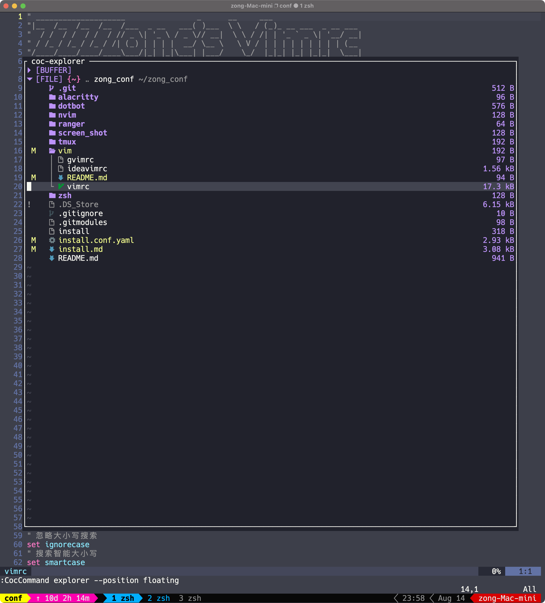

# vim

## vimrc

插件管理工具:  
[vim-plug](https://github.com/junegunn/vim-plug)

LSP插件:  
[coc.nvim](https://github.com/neoclide/coc.nvim)

## ideavimrc

### 按键映射

> 和nvim常用快捷键基本一致

| 按键      | goland Action | 备注|
| ----------- | ----------- | ----------- |
| `nmap gd` | GotoDeclarationOnly | 跳转到定义 |
| `nmap gf` | GotoDeclaration | 跳转到声明 |
| `nmap gi` | GotoImplementation | 跳转到实现 |
| `nmap gu` | GotoSuperMethod | 跳转到接口 |
| `nmap gt` | GotoTest | 跳转到单测 |
| `nmap <C-c>` | GotoAction | 打开 action 窗口， 对应nvim的 CocExtention|
| `nmap H` | QuickJavaDoc | 查看文档 |
| `nmap [g` | GotoPreviousError | 上一个错误 |
| `nmap ]g` | GotoNextError | 下一个错误 |
| `nmap ]c` | VcsShowNextChangeMarker | 上一个git hunk |
| `nmap [c` | VcsShowPrevChangeMarker | 下一个git hunk |
| `nmap <C-p>f` | GotoFile | 文件查找， 对应nvim的 fzf find file |
| `nmap <C-p>t` | GotoClass ||
| `nmap <C-p>l` | GotoLine | 行查找， 对应fzf  |
| `nmap <C-p>w` | FindInPath | 关键字查找， 对应fzf |
| `nmap <C-p>b` | ShowBookmarks | 查看书签列表 |
| `nmap <C-p>s` | FileStructurePopup ||
| `nmap <leader>t` | $ExclusiveTranslateAction | 翻译光标对应的单词， 需要安装[translation](https://github.com/YiiGuxing/TranslationPlugin)插件|
| `vmap <leader>t` | $TranslateTextComponent | 翻译光标对应的块 |
| `vmap <leader>r` | $TranslateAndReplaceAction | 翻译并替光标对应的单词换 |
| `nmap <C-O>` | Back |
| `nmap <C-I>` | Forward |
| `nmap <leader>k` | HighlightUsagesInFile | 高亮当前光标下的单词 对应 [vim-interestingwords](https://github.com/lfv89/vim-interestingwords)|
| `nmap <C-N>` | GotoNextElementUnderCaretUsage |
| `nmap <C-P>` | GotoPrevElementUnderCaretUsage |
| `nmap <leader>b` | ToggleBookmark | 标记/取消标记书签 |
| `nmap ]b` | GotoPreviousBookmark | 上一个书签 |
| `nmap [b` | GotoNextBookmark | 下一个书签 |
| `nmap <leader>g` | ActivateProjectToolWindow | 文件树 |
| `nmap <leader>h` | Annotate | Git Blame |
| `nmap t[` | PreviousTab | 上一个tab页 |
| `nmap t]` | NextTab | 下一个tab页面 |
